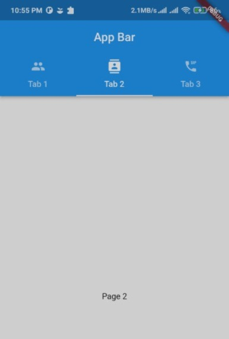
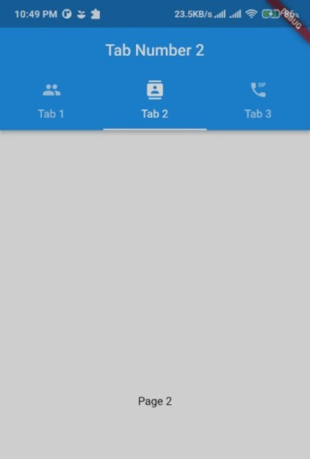

# <span style = "color:green" > **Tab View**

A tab view presents multiple mutually exclusive panes of content in the same area.which people can switch between using tabbed control.There are lots of apps where we come across tabs.Tabs are commonly found in apps as they make it easier for users to navigate.


# <span style="color:green">**Project Setup:** </span>

For this project you can create a new project or a new file in your existing project.No other dependencies are required.

# <span style="color:green"> Code:

## <span style="color:green"> Step 1:
Create a flutter project and erase all the sample code.We will only need a simple stateless widget for now.

~~~dart
import 'package:flutter/material.dart';

void main() {
  runApp(const MyApp());
}
class MyApp extends StatelessWidget {
  const MyApp({Key? key}) : super(key: key);
  @override
  Widget build(BuildContext context) {
    return MaterialApp(
      title: 'Tabbed View Tutorial',
      theme: ThemeData(
        primarySwatch: Colors.blue,
      ),
      home: Scaffold(
        //Code will be inserted here
      ),
    );
  }
}
~~~

## <span style="color:green">  Step 2: Adding the tabs

Now we will create a simple appbar, give it a title and use the Tabbar widget to add the tabs on the tabs on the top. as shown in figure 1

``` dart
Scaffold(
    appBar: AppBar(
      title: const Text('App Bar'),
      centerTitle: true,
      bottom: const Tabbar(
        tabs: [
          Tab(text: 'Tab 1'),
          Tab(text: 'Tab 2'),
          Tab(text: 'Tab 3'),
        ],
      ),
    ),

```

### <span style="color:red"> **This will give errors!!**

Now if you try to run the app you will face some errors because we haven't added any controllers for the tab bar. We will begin by making a simple static app and adding custom controllers down the line. for now we will wrap the scaffold widget under DefaultTabController Widget and assign length: 3 which denotes the number of tabs in our Tabbar widget. We will also add some icons to each of the tabs.

``` dart
home: DefaultTabController(
        length: 3,
        child: Scaffold(
          appBar: AppBar(
            title: const Text('app bar'),
            centerTitle: true,
            bottom: const Tabbar(
              tabs: [
                Tab(text: 'Tab 1',icon: Icon(Icons.people),),
                Tab(text: 'Tab 2',icon: Icon(Icons.contacts),),
                Tab(text: 'Tab 3',icon: Icon(Icons.dialer_sip),)
              ],
            ),
          ),
        ),
      ),
````

 >  **_CHALLENGE_:** Try adding more tabs in the Tabbar widget. Try putting 4 tabs instead of 3. <span sytle="color:red"> Can you do that? See the figure for better understanding.


## <span style="color:green">  Step 3: Adding content for each tab

We can add whatever content we desire for each of the tabs using the TabbarView widget. For simplicity I've only added simple texts for each page.

``` dart
 appBar: AppBar(
    title: const Text('app bar'),
    centerTitle: true,
    bottom: const Tabbar(
      tabs: [
        Tab(text: 'Tab 1',icon: Icon(Icons.people),),
        Tab(text: 'Tab 2',icon: Icon(Icons.contacts),),
        Tab(text: 'Tab 3',icon: Icon(Icons.dialer_sip),)
      ],
    ),
  ),
  body: const TabbarView(
      children: [
        Center(child: Text('Page 1'),),
        Center(child: Text('Page 2'),),
        Center(child: Text('Page 3'),),
      ],
  ),
```


## <span style="color:green">  Step 4: Convert to stateful widget

Before starting to add any more code you might wanna convert your 
stateless widget to a stateful. 

**learn more about stateful and stateless widget here  :**

1. [Creating a stateful widget](https://docs.flutter.dev/development/ui/interactive#:~:text=A%20widget%20is%20either%20stateful,are%20examples%20of%20stateless%20widget)
2. [Converting stateful to staless widget]( https://stackoverflow.com/questions/61387122/how-to-convert-a-stateful-widget-into-a-stateless-widget-in-flutter
)




## <span style="color:green"> Step 5 : Declare a TabController variable and override the initState() and dispose() methods.

Initialize the length in initState() method and make sure to add SingleTickerProviderStateMixin
with your class.
[SingleTickerProviderStateMixin is a mixin we can add to our 
StatelessWidget which will give us access to a Ticker .Ticker 
is a class that fires a callback once per animation frame.]

Override the dispose() method as shown below. this will release the memory allocated to 
the existing variables of the state.

``` dart
class _MyAppState extends State<MyApp> with
SingleTickerProviderStateMixin {
  late TabController controller;
 
 
 //override initSate() to initialize controller
 @override
 void initState() {
   super.initState();
   controller = TabController(length: 3, vsync: this);
 }
 
 
 //override dispose()
 @override
 void dispose() {
   controller.dispose();
   super.dispose();
 }
 
 /*
 
 code
 */
}
```

## <span style="color:green">  Step 6: Add the controller property to Tabbar and TabbarView
  Following code is for adding the controller property to Tabbar and TabbarView.
 
```dart
Tabbar(
   controller: controller,
  
   /*
 
   code
 
   */
 ),
 
 
TabbarView(
   controller: controller,
       
   /*
 
   code
 
   */
 ),
 ```


## <span style="color:green"> Step 7: Navigation Button

We will now add some navigation buttons to the app to 
switch between the apps and use the controller we just
added to do so.

Add a listener in the initState method. listen to tap changes

```dart
@override
 void initState() {
   super.initState();
   controller = TabController(length: 3, vsync: this);
 
   controller.addListener(() {
     setState(() {});
   });
 
 }
 ```


Finally we will add two floating action Buttons to 
  navigate between the pages. 
 in the onPressed property of the floating action button 
  will can simply decrease / increase the controller.index
  to switch between tabs.
```dart
FloatingActionButton(
   onPressed: () {
     controller.animateTo(controller.index - 1);
   },
   child: const Icon(Icons.navigate_before),
 ),
 
class _MyAppState extends State<MyApp> with SingleTickerProviderStateMixin {
 
   /*
 
   code
 
   */
 
   appBar: AppBar(
       /*
 
       Code
 
       */   
   ),
   body: TabbarView(
      /*
 
       Code
 
       */  
   ),
 
   floatingActionButtonLocation: FloatingActionButtonLocation.centerDocked,
   floatingActionButton: Padding(
     padding: const EdgeInsets.all(8.0),
     child: Row(
       mainAxisAlignment: MainAxisAlignment.spaceBetween,
       children: <Widget>[
         FloatingActionButton(
           onPressed: () {
             controller.animateTo(controller.index - 1);
           },
           child: const Icon(Icons.navigate_before),
         ),
         FloatingActionButton(
           onPressed: () {
             controller.animateTo(controller.index + 1);
           },
           child: const Icon(Icons.navigate_next),
         )
       ],
     ),
 
   /*
   code
   */
}
```
# <span style = "color:green">Resources
1. [Flutter Documentation](https://docs.flutter.dev/cookbook/design/tabs)

2. [Youtube Video](https://www.youtube.com/watch?v=POtoEH-5l40)


# <span style = "color:red">Errors and Cautions
1. Make sure to use a stateful widget if you plan to add any animations or dynamic pages
2. Make sure the number tabs matches the value in the length property
3. make sure to add the "SingleTickerProviderStateMixin" (Step 5) when using a custom controller.
